# Technical Test

## Prueba Técnica Sobre Flutter

## `Se realizo un loading inspirado en un GIF de DRIBBBLE`
- ### [LOADING INSPIRATION](https://dribbble.com/shots/6098716-Flow-Motion-Loading-UI-UX-Animation)

## `Notas: Se realizo la conección a una API que se creo y se subio a Heroku, tiene paginación y límite`

# ScreenShots

<TABLE BORDER>
	<TR>
		<TD>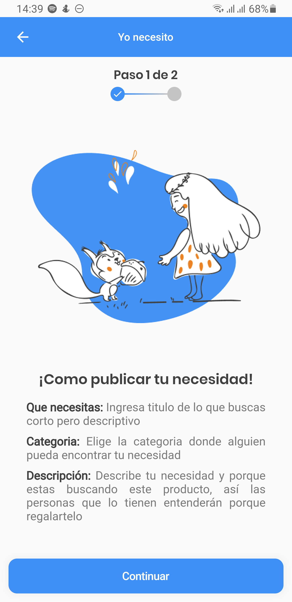</TD>
		<TD>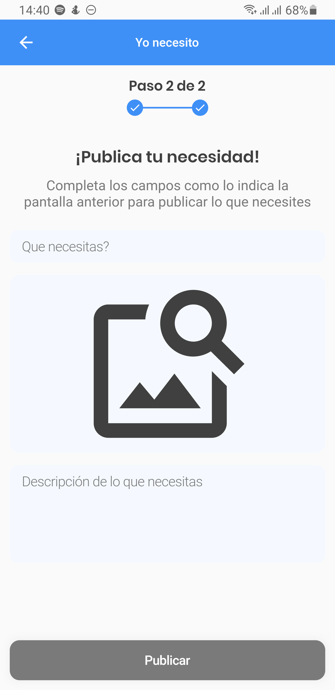</TD>
		<TD>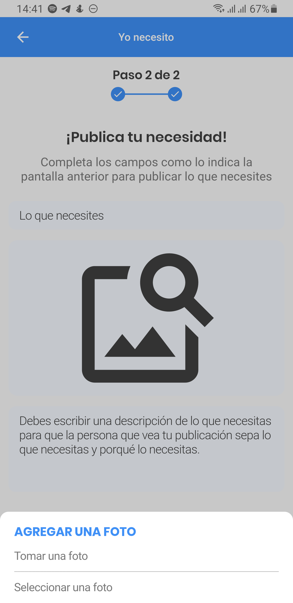</TD>
	</TR>
	<TR>
		<TD>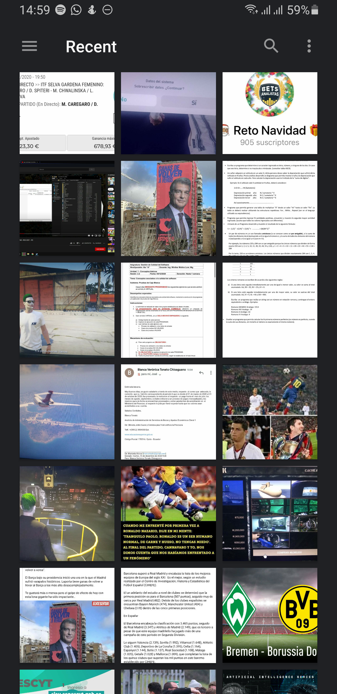</TD>
		<TD>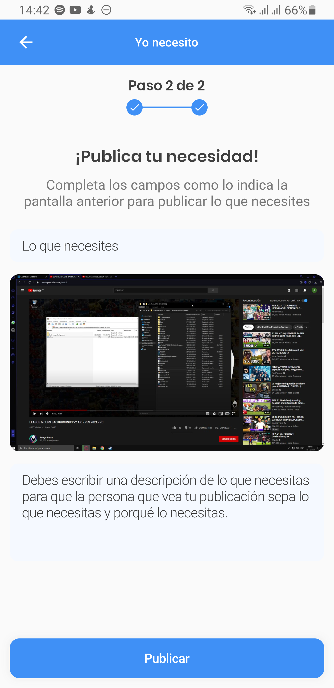</TD>
		<TD>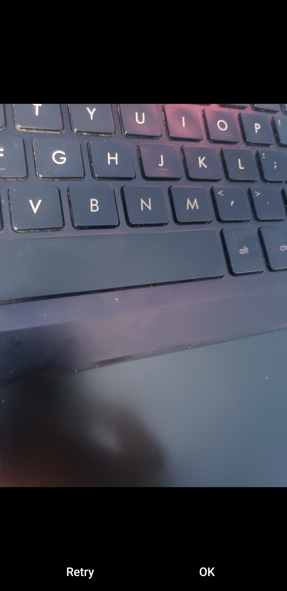</TD>
	</TR>
	<TR>
		<TD>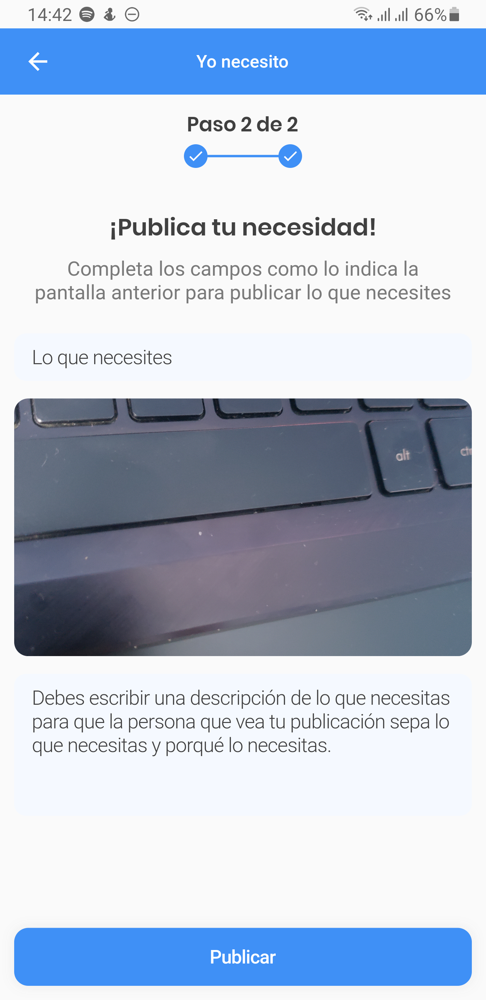</TD>
		<TD></TD>
		<TD>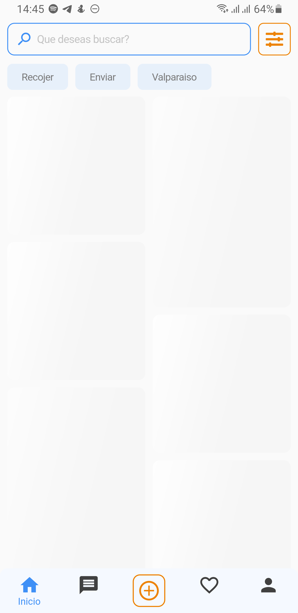</TD>
	</TR>
	<TR>
		<TD>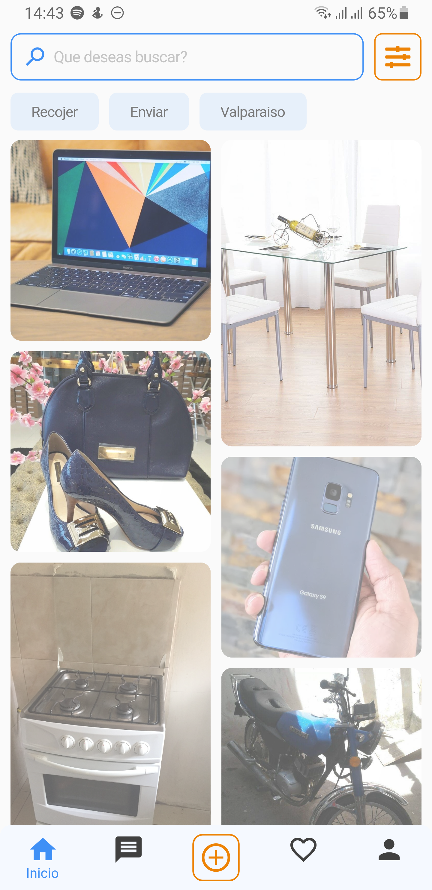</TD>
		<TD>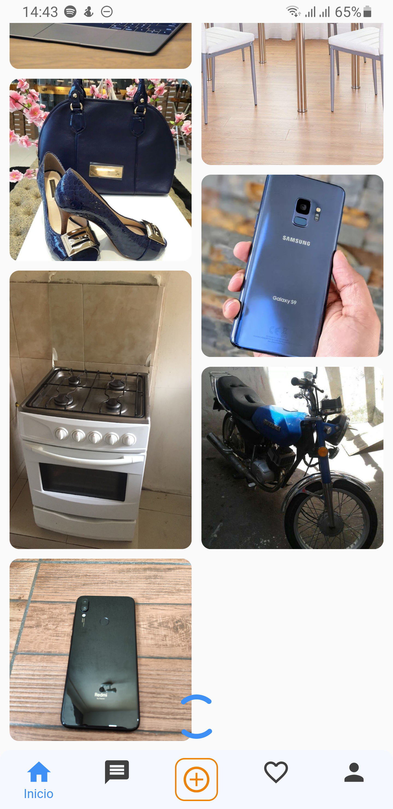</TD>
		<TD>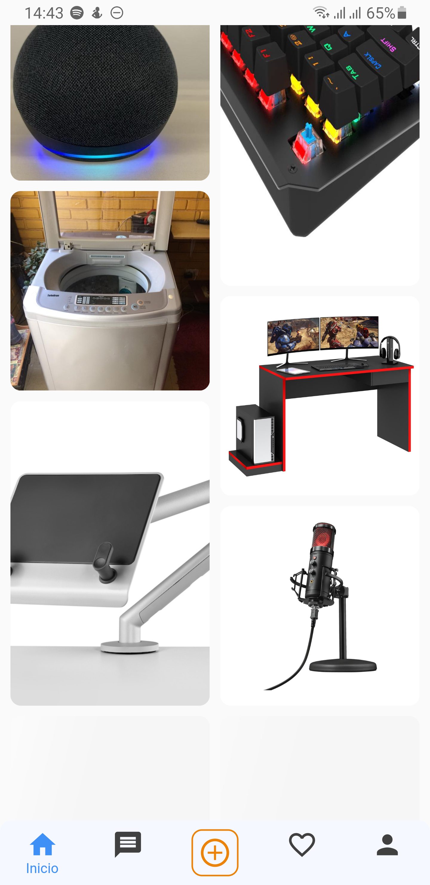</TD>
	</TR>
	<TR>
		<TD>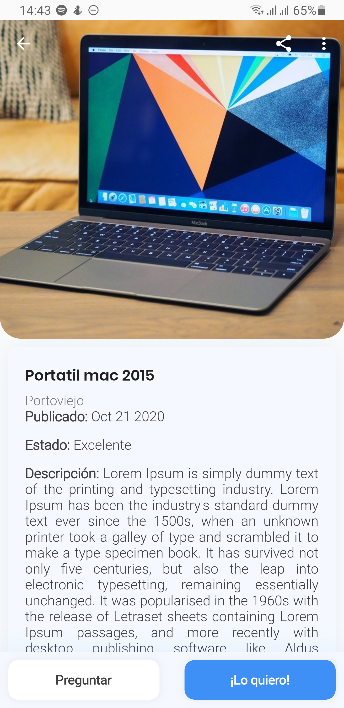</TD>
		<TD>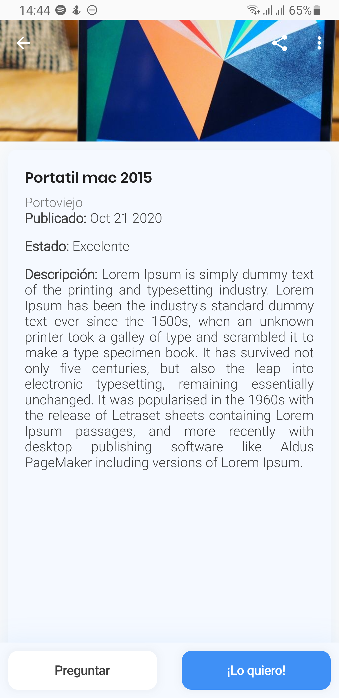</TD>
		<TD></TD>
	</TR>
</TABLE>

# Video

<iframe width="560" height="315" src="https://www.youtube.com/embed/jqFo80P92jw" frameborder="0" allow="accelerometer; autoplay; clipboard-write; encrypted-media; gyroscope; picture-in-picture" allowfullscreen></iframe>
