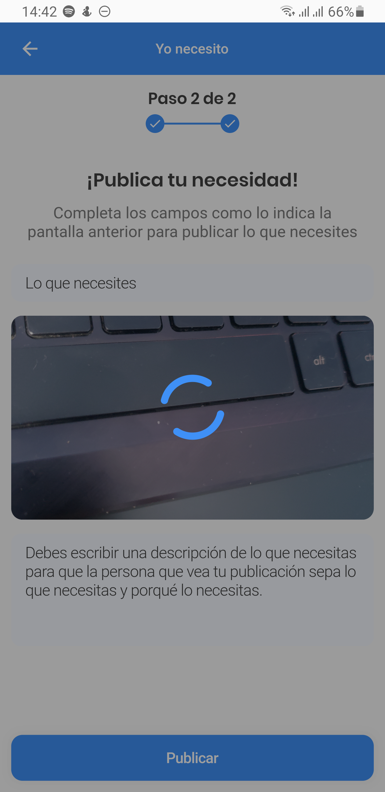
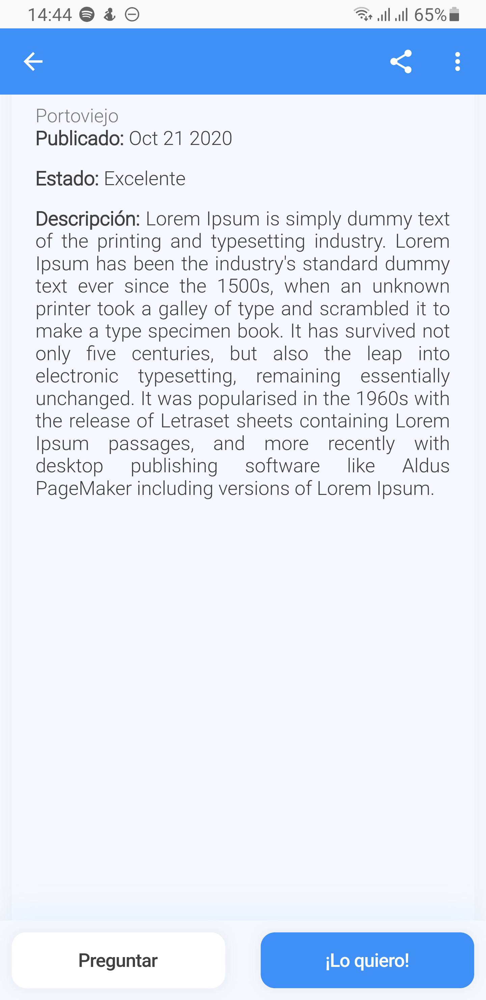

# Technical Test

## Prueba Técnica Sobre Flutter

## `Se realizo un loading inspirado en un GIF de DRIBBBLE`
- ### [LOADING INSPIRATION](https://dribbble.com/shots/6098716-Flow-Motion-Loading-UI-UX-Animation)

## `Notas: Se realizo la conección a una API que se creo y se subio a Heroku, tiene paginación y límite. Respecto a los estilos de las fuentes se podria haber creado constantes y reutilizarlas, pero decidi centrarme en realizar una buena arquitectura y con buenas practicas, separando la logica de la vista. Use Provider pero no use notifierListeners. Ya que esto me refresca a todo widget que este escuchando, por eso cree micro-notificadores con ValueNotifier, tambien cree widgets reutilizables, cree customWidgets y package para la UI el unico fue flutter_staggered_grid_view`

# ScreenShots

<TABLE BORDER>
	<TR>
		<TD></TD>
		<TD></TD>
		<TD></TD>
	</TR>
	<TR>
		<TD></TD>
		<TD></TD>
		<TD></TD>
	</TR>
	<TR>
		<TD></TD>
		<TD></TD>
		<TD></TD>
	</TR>
	<TR>
		<TD></TD>
		<TD></TD>
		<TD></TD>
	</TR>
	<TR>
		<TD></TD>
		<TD></TD>
		<TD></TD>
	</TR>
</TABLE>

- ## [Video](https://www.youtube.com/watch?v=jqFo80P92jw)
